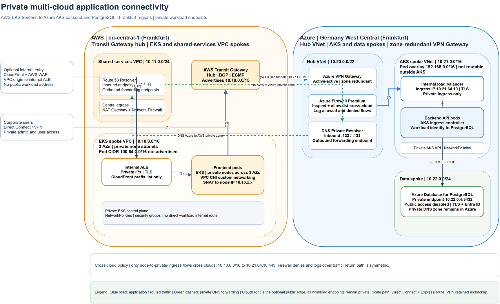

# Platform Engineer / DevOps Engineer: Interview Exercise
 
A small Go HTTP service, containerized, provisioned on **Azure Container Apps** with **Terraform**, and delivered by a **GitHub Actions** pipeline that authenticates to Azure with **OIDC (no stored secrets)**. Everything runs inside free tiers ($0 budget).
 
| Section | Where |
| --- | --- |
| 1. Platform baseline (container, IaC, CI/CD) | `app/`, `Dockerfile`, `infra/`, `.github/workflows/`, `.azuredevops/pipeline.yaml` |
| 2. Security hardening | [Security](#security), `.trivyignore`, `docs/evidence/` |
| 3. Multi-cloud connectivity design | `docs/network-design.md`, `docs/network-diagram.drawio` / `.png` |
| 4. Observability & reliability | `docs/observability.md`, `docs/alerts.yaml` |
 
---
 
## Architecture
 
```
 developer ──PR──▶ GitHub ──▶ ci.yml:  test · lint · SCA/secret/IaC scan · build · image scan · tf plan · kind
                         └─▶ cd.yml:  build · scan · push (GHCR, by digest) · tf apply · smoke test
                                            │ OIDC (federated credential, no secret)
                                            ▼
      Azure subscription (Sweden Central)
        rg-platex-dev
          ├─ Log Analytics workspace (0.1 GB/day cap, 30-day retention)
          ├─ Container Apps environment (Consumption plan)
          ├─ Container App  ca-platex-dev  (HTTPS ingress, 0–2 replicas)
          └─ runtime managed identity (no role assignments)
        rg-platex-tfstate
          ├─ Storage account: Terraform state (Entra ID auth only, keys disabled, prevent_destroy)
          └─ GitHub OIDC identities: plan (pull requests), deploy-dev (GitHub Environment "dev")
```
 
## Conceptual Network Design (Exercise Section 3)

The network design below is a **concept for the separate multi-cloud scenario in Section 3 of the exercise**. It is not the architecture provisioned by this repository: the demo application runs on Azure Container Apps, and `infra/` does not create the AWS, AKS, VPN, firewall, or PostgreSQL resources shown here.

The diagram captures how I reason about private connectivity across cloud boundaries: hub-and-spoke networks, non-overlapping address ranges, redundant encrypted paths, private DNS, inspected traffic, and restricted workload access. It is intended to communicate the design and tradeoffs, not to claim that this topology has been deployed.



See the [network design](docs/network-design.md) for the traffic flows, CIDR plan, security controls, and tradeoffs, or open the [editable draw.io diagram](docs/network-diagram.drawio).

## Repository layout
 
```
app/                          Go service (standard library only): /health, /ready, /
Dockerfile                    multi-stage → distroless static, non-root (UID 65532)
infra/bootstrap/              one-time: providers, state backend, OIDC identities, role assignments, budget
infra/                        main stack (main.tf, variables.tf, outputs.tf) + envs/<env>.tfvars / .backend.hcl
infra/modules/container-app/  reusable module: Log Analytics, environment, app, runtime identity
k8s/                          Deployment / Service / PDB / NetworkPolicy, validated on kind in CI
.github/workflows/            build.yml (reusable), ci.yml (pull requests), cd.yml (main)
.github/dependabot.yml        weekly updates for actions, base images, Go, Terraform providers
.azuredevops/pipeline.yaml    Azure DevOps equivalent of the GitHub pipeline
docs/                         design docs (sections 3–4) and validation evidence
Makefile                      one-command local workflows (`make help`)
```
 
---
 
## Run locally
 
Prerequisites: Docker, Go 1.27+, and optionally Trivy, hadolint and kind.
 
```bash
make test            # unit tests (race detector + coverage)
make run             # build the image and run it on http://localhost:8080 (read-only FS, all capabilities dropped)
make smoke           # in another shell: curl /health
make scan            # Trivy: dependencies + secrets, image, IaC
make kind-test       # deploy the k8s manifests to a local kind cluster
```
 
| Path | Purpose |
| --- | --- |
| `GET /health` | liveness: `{"status":"ok"}` |
| `GET /ready` | readiness: returns 503 while draining after SIGTERM |
| `GET /` | service name, **version (git SHA)** and environment, used to verify a deployment |
 
Every response carries an `X-Request-ID` header, propagated from the request or generated. Every request is logged as one JSON line carrying that ID.
 
---
 
## Deploy to Azure
 
One-time setup, then everything is automated. The order matters: the GitHub repo must exist before the bootstrap, because the Azure identities are bound to it.
 
**1. Accounts.** You need an Azure free account and a **public** GitHub repo (`gh repo create platform-exercise --public`). Actions minutes and GHCR storage are free for public repos.
 
**2. Find the OIDC subject GitHub will send.** Newer GitHub repos include the numeric owner and repo IDs in the OIDC token subject:
 
```bash
gh api repos/<owner>/platform-exercise --jq '"repo:\(.owner.login)@\(.owner.id)/\(.name)@\(.id)"'
# e.g. repo:1MaRo2@106168157/platform-exercise@1388116914
```
 
**3. Bootstrap** (run once, as a subscription Owner; uses local state):
 
```bash
az login
cd infra/bootstrap
cp terraform.tfvars.example terraform.tfvars
# fill in: subscription_id, a globally unique state_storage_account_name,
#          github_repository, budget_contact_emails, and
#          github_oidc_subject_prefix = "<output of step 2>"
terraform init && terraform apply
terraform output
```
 
Keep `infra/bootstrap/terraform.tfstate` safe; git ignores it.
 
**4. Backend config.** Put `backend_config.storage_account_name` from the output into `infra/envs/dev.backend.hcl`. Then generate and commit the provider lock file:
 
```bash
cd ../
terraform init -backend-config=envs/dev.backend.hcl
terraform providers lock -platform=linux_amd64 -platform=darwin_arm64 -platform=windows_amd64
```
 
**5. GitHub variables.** These are IDs, not secrets. Set them straight from the bootstrap output:
 
```bash
cd bootstrap
gh variable set AZURE_TENANT_ID       --body "$(terraform output -raw tenant_id)"
gh variable set AZURE_SUBSCRIPTION_ID --body "$(terraform output -raw subscription_id)"
gh variable set AZURE_PLAN_CLIENT_ID  --body "$(terraform output -raw plan_client_id)"
gh api -X PUT "repos/{owner}/{repo}/environments/dev"
gh variable set AZURE_DEPLOY_CLIENT_ID --env dev \
  --body "$(terraform output -json deploy_client_ids | sed -E 's/.*"dev":"([^"]+)".*/\1/')"
```
 
**6. Push to `main`.** The first `cd` run builds, scans and pushes the image, and GHCR creates the package as **private**. Make it **public** once (your profile → Packages → platform-exercise → Package settings → Change visibility), then re-run the deploy job with `gh run rerun <run-id> --failed`. Container Apps pulls public images without registry credentials.
 
**7. Verify.** The deploy job prints the app URL. It fails unless `/health` returns 200 and `/` reports the commit SHA that was just built.
 
**Teardown:** run `terraform -chdir=infra destroy`. The state storage account and container have `prevent_destroy = true`, so to remove the bootstrap, delete those two `lifecycle` blocks first, then run `terraform -chdir=infra/bootstrap destroy`. Alternatively, delete both resource groups.
 
> **Windows (Git Bash):** prefix commands that take an Azure resource ID with `MSYS_NO_PATHCONV=1`. Otherwise Git Bash rewrites `/subscriptions/...` into a Windows path. PowerShell doesn't have this problem.
 
---
 
## Pipeline
 
```
ci.yml (pull_request)                         cd.yml (push to main)
 ├─ build.yml (reusable, push: false)           ├─ build.yml (push: true)
 │   ├─ test      gofmt · vet · go test -race    │   └─ same gates, then push the scanned image, output its digest
 │   ├─ lint      hadolint · tflint (azurerm)    └─ deploy (environment: dev, concurrency: 1)
 │   ├─ security  trivy fs (SCA + secrets)            OIDC → terraform apply image@sha256
 │   │            trivy config (IaC) gate + SARIF      smoke test: /health + version == SHA
 │   └─ image     buildx (GHA cache) · trivy image gate · SARIF · SBOM
 ├─ terraform-plan  OIDC (plan identity) · fmt · validate · plan → job summary (skipped for Dependabot)
 └─ kind            apply k8s manifests · rollout status · curl /health
```
 
- **Build once, deploy the digest.** The image that passed the scan is exactly the one pushed (`docker push` of the loaded image). Terraform deploys it by `@sha256` digest, never by `latest`.
- **Gates are separate from reports.** Each Trivy scan runs twice. The gate scans with severity HIGH/CRITICAL and `exit-code 1`. The report scans all severities as SARIF for the GitHub Security tab, with `exit-code 0`. Combining the two made the gate fail on low-severity findings, because the Trivy action ignores the severity filter when writing SARIF.
- **Caching.** BuildKit layer cache in the GitHub Actions cache (`type=gha,mode=max`), Go build cache mounts in the Dockerfile, and a Terraform provider plugin cache.
- **Safe re-runs.** Terraform is idempotent. Deploys are serialized (`concurrency: deploy-dev`, never cancelled mid-apply) and use blob leases; `-lock-timeout` absorbs contention. Pull-request plans use `-lock=false` and a read-only state role, so they cannot change state but may read the previous state if they overlap a deployment.
- **Reusability.** One reusable build workflow serves both pull requests and `main`. One Terraform module is reused per environment through `envs/<env>.tfvars` and `envs/<env>.backend.hcl`.
---
 
## Design decisions & assumptions
 
| Decision | Choice | Why | Alternative considered |
| --- | --- | --- | --- |
| Language | Go, standard library only | Static binary, ~6 MB image, zero third-party dependencies | Python/Node: faster to write, 10–20× larger images |
| Runtime image | `distroless/static:nonroot` | No shell or package manager, tiny attack surface, non-root by default | `scratch` (no CA certs or tzdata), Alpine (has a shell) |
| Hosting | Azure Container Apps, Consumption plan | Serverless containers, free HTTPS ingress, scale to zero, free monthly grant | AKS (paid nodes, more to operate), App Service |
| Region | Sweden Central | West Europe refused new resources for this subscription ("not accepting new customers") | North Europe, Germany West Central |
| Registry | GHCR, public package | Free; pushed with the job's short-lived `GITHUB_TOKEN` | ACR: no free tier (Basic is ~$5/month) |
| CI/CD | GitHub Actions (+ Azure DevOps YAML) | Native OIDC to Entra ID, free for public repos | Azure DevOps only: its free agent needs an approval request |
| Auth to Azure | User-assigned managed identities with federated credentials | No client secrets to store or rotate; subject pinned to repo IDs + environment | Service principal + secret |
| IaC state | Azure Storage, Entra ID auth, keys disabled, versioned | Native locking, no access keys, recoverable | HCP Terraform free tier |
| Role assignments | Only in `bootstrap` | CI never needs Owner or User Access Administrator | CI assigns roles (needs a privileged role) |
| Resource providers | Registered explicitly by bootstrap | The stack runs with `resource_provider_registrations = "none"`, so nothing is registered implicitly | Let the provider auto-register (needs subscription-wide rights in CI) |
 
Assumptions: a single subscription and a single environment (`dev`), parameterized for more. The demo service must be publicly reachable, so it uses public ingress; Section 3's "no public endpoint" requirement applies to the enterprise design, not to this demo. With a $0 budget, nothing with an hourly charge is created (no ACR, NAT, gateways or databases).
 
---
 
## Security
 
### What I hardened, in priority order
 
1. **No long-lived credentials anywhere** (highest blast radius). GitHub → Azure uses OIDC federated credentials whose subject includes the immutable GitHub owner and repo IDs, so a deleted or renamed repo recreated under the same name cannot assume them. The plan identity only works for `pull_request`; it has Reader on environment resource groups and Storage Blob Data Reader on state, and PR plans use `-lock=false`. The deploy identity only works from the `dev` GitHub Environment and has Contributor on one resource group. The state storage account has shared keys disabled. GHCR uses the per-job `GITHUB_TOKEN`. The client, tenant and subscription IDs stored in GitHub are not secrets: without a matching GitHub-issued token they grant nothing.
2. **Vulnerable artifacts cannot ship.** Every build scans the repo's dependencies and secrets, the Terraform and k8s files, and the image before it is pushed. Each scan fails the build on fixable HIGH/CRITICAL findings. Results go to the GitHub Security tab (SARIF), and a CycloneDX SBOM is attached to every build.
3. **Minimal, non-root runtime.** Distroless static image, UID 65532, no shell. In k8s: `runAsNonRoot`, `readOnlyRootFilesystem`, `allowPrivilegeEscalation: false`, all capabilities dropped, `RuntimeDefault` seccomp, no service-account token, default-deny NetworkPolicy.
4. **Least privilege at runtime.** The app's managed identity has no role assignments.
5. **State protection.** The state storage account and container have `prevent_destroy`, versioning and soft delete. PR plans cannot write state or acquire its lease; deployments retain normal state locking.
6. **Supply chain.** Every third-party action is pinned by commit SHA. Workflows start from `permissions: {}` and grant per job. Dependabot tracks actions, base images, Go and providers, and ignores major provider versions, which need a deliberate upgrade.
### Policy on HIGH/CRITICAL findings
 
The build **fails** on HIGH or CRITICAL findings that have a fix available (`--ignore-unfixed`). Unfixed CVEs don't block delivery, because the team can't act on them; they stay visible in the Security tab. Any accepted finding goes in `.trivyignore` with a reason, an owner and an expiry date, and is reviewed like code. One finding is accepted today: `AZU-0012`, the state storage account's network access. The file gives the rationale and mitigations.
 
### Evidence
 
- [Successful CD run](https://github.com/1MaRo2/platform-exercise/actions/runs/36275811933): the build, scans, deploy and smoke test all passed.
- `docs/evidence/terraform-bootstrap-plan.txt`: the current bootstrap plan reports **No changes**. This is the bootstrap stack, not the dev application plan.
- [`terraform-bootstrap-plan.txt`](docs/evidence/terraform-bootstrap-plan.txt): the current bootstrap plan reports **No changes**. This is the bootstrap stack, not the dev application plan.
- [Screenshot of the failed image-scan job](docs/evidence/trivy-gate-failure.png) in [Actions run 36196043670](https://github.com/1MaRo2/platform-exercise/actions/runs/36196043670). The corresponding [`trivy-image-before.txt`](docs/evidence/trivy-image-before.txt) report records **19 HIGH** Go 1.24.13 standard-library CVEs; the gate blocked the push.
- `docs/evidence/trivy-image-after.txt`: the scan after moving the build to Go 1.27, with 0 HIGH/CRITICAL.
- `docs/evidence/trivy-config.txt`: the IaC scan, with 1 CRITICAL accepted with its rationale and 0 unaccepted.
- [`local-checks.txt`](docs/evidence/local-checks.txt): current Go 1.27 vet, race-test, build, hadolint and Terraform format results; unavailable local checks are called out.
### Tradeoffs made under the time and budget limits
 
- Public ingress on the demo app, and a public GHCR image instead of a private ACR.
- `--ignore-unfixed` trades completeness for a pipeline that doesn't block on unpatchable CVEs.
- The deploy identity uses the built-in Contributor role on the resource group rather than a custom role.
- The state storage account is reachable from the internet (Entra ID auth only), because GitHub-hosted runners have no fixed IP addresses.
- No image signing or admission-time verification.
- The Azure DevOps variant needs one scoped PAT to push to GHCR; GitHub Actions needs none.
### What I'd fix with more time
 
- VNet-integrated Container Apps environment with internal ingress behind Front Door + WAF.
- Private ACR with managed-identity pull and Defender for Containers.
- cosign or Notation image signing, verified at deploy.
- A custom least-privilege deploy role.
- Azure Policy to deny public storage and require tags.
- A private endpoint for the state storage, with self-hosted runners.
- Branch protection with required checks.
- A DAST baseline scan (OWASP ZAP) against the deployed URL.
---
 
## Known limitations
 
- Single environment. Adding `stg` or `prod` needs a tfvars file, a backend file, a GitHub Environment and an entry in the bootstrap's `environments` variable.
- The deploy applies without a separate manual approval; the pull-request plan is the review gate. A required reviewer can be added on a `prod` environment.
- Pull requests from forks and from Dependabot get no OIDC token or variables, so the Terraform plan job is skipped for them.
- Scale-to-zero means the first request after idle cold-starts for a few seconds. The smoke test retries.
- Base images are pinned by tag. Dependabot proposes updates, and digest pinning is a follow-up.
## Improvements
 
- Promote the same image digest across environments.
- Save the Terraform plan as an artifact and apply exactly that plan.
- OpenTelemetry instrumentation (see `docs/observability.md`).
- Infracost in pull requests.
- A Helm chart instead of raw manifests, if the Kubernetes path becomes the real target.
---
 
## What I tried / where I got stuck
 
Each of these failed the first time. Each entry records how I diagnosed it and what changed.
 
1. **Region refused.** The first bootstrap apply failed with `RequestDisallowedByAzure: The selected region is currently not accepting new customers`, because West Europe is closed to new subscriptions. I moved everything to **Sweden Central**. The region is a variable, with alternatives listed in `terraform.tfvars.example`.
2. **Resource provider not registered.** The storage account failed with `MissingSubscriptionRegistration: Microsoft.Storage`. The stack deliberately disables implicit provider registration, and I had left Storage and Consumption off the bootstrap's list. I added both, and the storage account and budget now wait for registration. `Microsoft.Consumption` was already registered on the subscription, so Terraform refused to adopt it; I imported it with `terraform import`. On Windows, Git Bash rewrote the `/subscriptions/...` import ID into a file path, which `MSYS_NO_PATHCONV=1` fixes.
3. **Backend placeholder.** `terraform init` tried to reach `REPLACE_ME.blob.core.windows.net`. I filled in `envs/dev.backend.hcl` from the bootstrap output and re-ran init with `-reconfigure`.
4. **First pipeline run: three gates failed, which is the gates doing their job.**
   - **tflint** flagged the state storage for lacking `prevent_destroy`. I added it; the rule is right for state.
   - **IaC scan** failed on low-severity findings, because one step both gated and wrote SARIF, and the action ignores the severity filter for SARIF. I split each scan into a gate step and a report step.
   - **Image scan** found 19 HIGH CVEs in the Go 1.24.13 standard library, a Go version out of security support. The push was blocked, as intended. I moved the build to Go 1.27, in both the Dockerfile and `go.mod`, which clears all of them.
5. **Azure sign-in, part 1: AADSTS90013 "Invalid input".** The GitHub variables held placeholder text instead of the GUIDs, so the OIDC request was malformed. I now set the variables directly from `terraform output`.
6. **Azure sign-in, part 2: AADSTS700213 "No matching federated identity record".** GitHub's OIDC subject for this repo includes immutable IDs (`repo:<owner>@<id>/<repo>@<id>:environment:dev`), but the credential used the name-only format. Azure's error showed the exact subject it received. I made the subject prefix a bootstrap variable, `github_oidc_subject_prefix`, and matched it. The ID-based subject is also stronger.
7. **Dependabot.** Dependabot immediately proposed azurerm 4.x → 5.x, a major version with breaking changes. I closed those pull requests and configured Dependabot to ignore major provider versions; those get a deliberate upgrade instead.